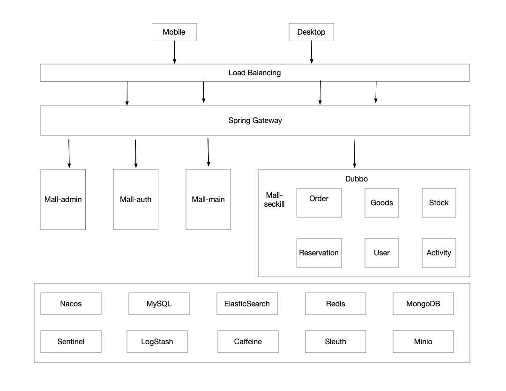

# Sophie-mall

[English](README.md) | 中文

Sophie-mall 是一套微服务商城系统，基于Spring Cloud & Alibaba、Spring Boot 3.2、Sa-Token、MyBatis、ElasticSearch、Dubbo、Redis等核心技术，配置基于Vue的管理后台。

## 系统架构

## 内置功能
1. 后台管理系统：优选专区管理、商品专题管理、收获地址管理、退货管理、订单管理、商品管理、促销管理（优惠券、秒杀活动、首页广告、首页品牌、首页新品等）、后台用户管理等
2. 前台商城系统：付款功能、首页内容获取、用户关注品牌、用户收藏商品、用户浏览历史记录、购物车管理、会员收获地址管理等
3. 秒杀系统： 获取秒杀活动详情、秒杀活动预约、秒杀活动抢购等功能

## 模块说明
1. sophie-mall-admin: 后台管理模块
2. sophie-mall-auth: 认证中心
3. sophie-mall-common: 各个模块的公共组件
4. sophie-mall-gateway: 业务网关
5. sophie-mall-main: 前台商城模块
6. sophie-mall-mbg: mybatis代码生成
7. sophie-mall-monitor: 系统监控
8. sophie-mall-search: 商城搜索模块
9. sophie-mall-seckill: 秒杀系统模块

## 开源许可
Sophie-mall 基于[Apache License 2.0](LICENSE) 许可证

## 联系方式
- Email: hq869860837@163.com
- Issues: [Issues](https://github.com/user823/Sophie-mall/issues)
- 企鹅: 869860837